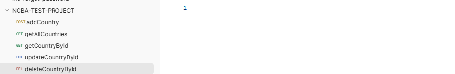

1.	This runs on the latest spring boot version
2.	To run it locally follow the below steps
      •	Glone the project from https://github.com/kipkuruibarnaba/ncba_case_study.git
      •	Ensure you have mysql database called ncba_case_study_db
      •	Run the project and ensure it has started on port 8585  -> http://localhost:8585/api/country
      •	Test on via postman
      With below request body .This will do calls to the soap endpoints and save data to the database.
      {
      "name": "kenya"
      }
      •	You can proceed and test other crud operations below
      GET -> http://localhost:8585/api/country     -> For getting all conutries in the database
      GET -> http://localhost:8585/api/country/3   -> Get a single coutry by ID
      UPDATE -> http://localhost:8585/api/country/3    -> Do an update

            {
      "id": 3,
      "isoCode": "KE",
      "name": "Kenya",
      "capitalCity": "Nairobi",
      "phoneCode": "254",
      "continentCode": "ASS",
      "currencyCode": "KES",
      "countryFlag": "http://www.oorsprong.org/WebSamples.CountryInfo/Flags/Kenya.jpg"
      }
      DELETE  ->  http://localhost:8585/api/country/2

